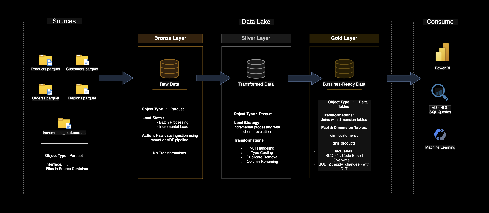
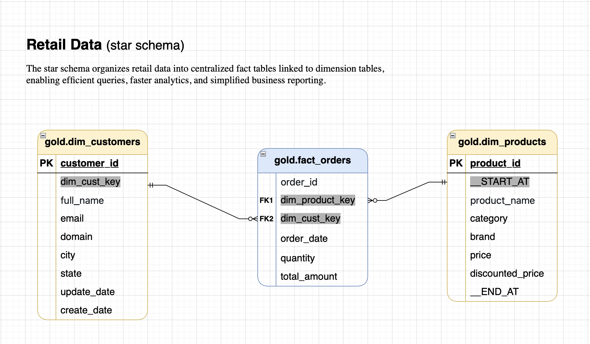

# 🛍️ RetailDataFlow 360

An end-to-end data engineering pipeline built using **Azure Data Lake**, **Databricks**, and **Delta Live Tables**, applying **Medallion Architecture** principles and delivering a dimensional star schema for retail analytics.

---

## 🔧 Project Overview

This project demonstrates how to:
- Load raw retail data (products, customers, orders, regions) from Azure Data Lake
- Build **Bronze**, **Silver**, and **Gold** layers using Delta Lake
- Transform and cleanse data using PySpark and Delta Live Tables (DLT)
- Model data into a **star schema** with fact and dimension tables
- Apply **SCD Type 1** and **SCD Type 2** logic to track changes
- Enable downstream consumption via BI tools (Power BI, SQL, ML)

---

## 🏗️ Architecture

### Layers:

- **Bronze**: Raw ingestion from `.parquet` files using ADF / Databricks
- **Silver**: Cleaned and transformed data (null handling, deduplication)
- **Gold**: Final business-ready tables in star schema

---

## ⭐ Star Schema

### Gold Layer Tables:
- `gold.dim_customers` – SCD Type 1 (code-based)
- `gold.dim_products` – SCD Type 2 (DLT `apply_changes`)
- `gold.fact_orders` – Order facts linked to dimension tables

---

## 🔁 Notebooks Overview

| Layer  | Notebook                  | Description                           |
|--------|---------------------------|---------------------------------------|
| Gold   | `gold_customers.dbc`      | Dim_Customers with SCD1 logic         |
| Gold   | `gold_products.dbc`       | Dim_Products with SCD2 (DLT pipeline) |
| Gold   | `gold_fact_orders.dbc`    | Fact table creation and joins         |
| Silver | `silver_customers.dbc`    | Cleaning and transforming customers   |
| Silver | `silver_orders.dbc`       | Processing raw orders                 |
| Silver | `silver_regions.dbc`      | Optional: regional metadata           |

---

## ⚙️ Technologies Used

- **Azure Data Lake**
- **Databricks**
- **PySpark**
- **Delta Lake**
- **Delta Live Tables (DLT)**
- **Power BI / SQL Endpoints**

---

## ✅ Features

- Full Medallion Architecture (Bronze → Silver → Gold)
- Dimensional modeling with a clear star schema
- SCD1 and SCD2 dimension management
- Scalable and modular notebooks
- Ready for BI and ML consumption

---

## 📊 Consumption Layer

Data from the Gold layer is consumed via:
- 🔶 Power BI dashboards
- 🔍 Ad-hoc SQL queries
- 🤖 Machine Learning models (optional extension)

---

## 📝 Author

**Arigela Thrinesh**  
_Data Engineering Enthusiast | Azure | PySpark | SQL_

---

